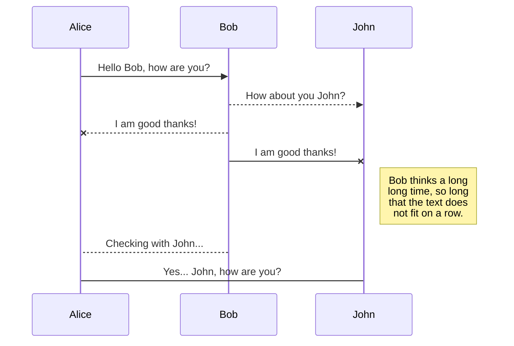

This is a test post which outlines some features of this site.

<!--more-->

## Structure

- New pages can be published by committing new markdown files to the `contents/` directory.
- News articles live in the `contents/news/` directory.
- The menu items can be changed from the `hugo.yaml` file.

## Formatting

Here's an overview of the formatting supported on the site.
A more in-depth guide can be found in the [documentation of the theme](https://imfing.github.io/hextra/docs/guide/).

### Markdown

_All_ common **Markdown** formatting is supported.

### Math

Besides that, Latex can be displayed if the `math: true` frontmatter attribute is enabled.

$$ \sigma(z) = \frac{1}{1 + e^{-z}} $$

### Diagrams

Mermaid diagrams are supported!

